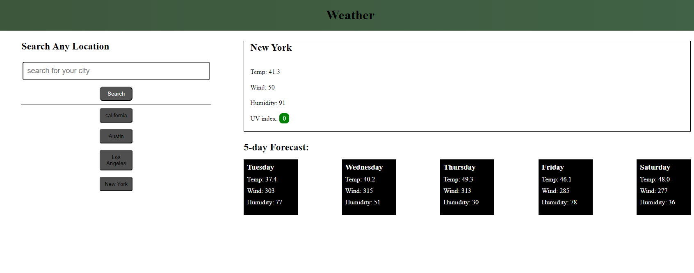

# weather-reports
## Description

My motivation for this project was to build a weather website that displays temperature, wind, humidity, and the UV index. Constructing a weather website is helpful for many coders as it is a typical interview project. This project helped me learn more about JavaScript and APIs. I built this project to test my JavaScript and API skills. One of the major struggles I had with the weather website was getting the APIs to work properly. It took a lot of reading and watching YouTube tutorials. I feel accomplished that I finally finished this project after it took me so long. 

## Table of Contents

- [Installation](#installation)
- [Usage](#usage)
- [Credits](#credits)
- [License](#license)

## Installation

- Follow the website link listened under Usage
- Search for any city
- Have weather reports listed to you
- Previous cities searched will be listed below the search bar

## Usage
    
A picture of the working website.

## License

[MIT-License](./LICENSE)

## Badges

